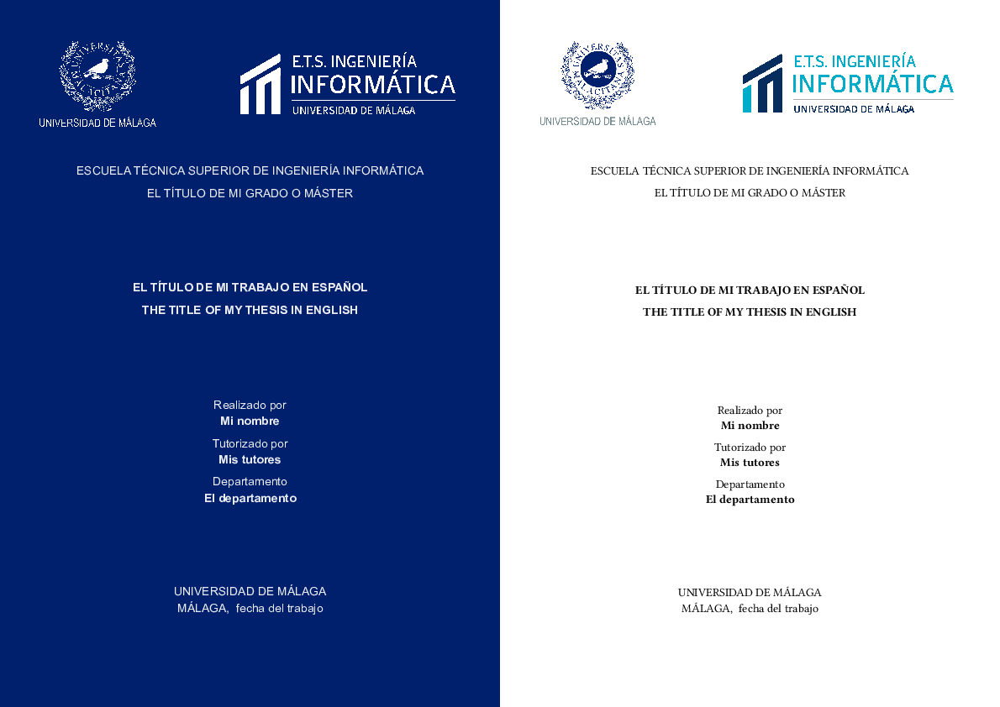

# Plantilla de TFG / TFM

<p align="center">



</p>

## Descripción

***Aviso**: Esta plantilla **no es oficial** y podría no estar actualizada con los requisitos de presentación del trabajo de fin de grado o máster más actuales. Las decisiones de estilo se han tomado revisando varios TFGs y TFMs y otras plantilas existentes disponibles en internet.*

Esta es una plantilla para trabajos finales de grado o máster en la Escuela Técnica Superior de Ingeniería Informática de la Universidad de Málaga.

Está contenida en un solo fichero y basta con importar este en un documento [Typst](https://typst.app/docs/) para utilizarla. Aunque el propio código de la es muy ligero, el peso del fichero es debido principalmente a las imágenes incrustadas que usan para la portada.

### Características

- Portada con los logos de la universidad y de la escuela, a seleccionar entre el estilo oscuro (fondo azul, logos en negativo y letra sin serifa), el claro (logos en positivo y letra con serifa) o ambos (el oscuro primero y el claro después).
- Inclusión de un resumen (*abstract*) en inglés y otro en español, igual que para las palabras clave.
- Tabla de contenidos con hiperenlaces.
- Cabeceras con la sección correspondiente a cada página.
- Estilizado de varios componentes como márgenes, encabezados o bloques de código para mejorar la presentación por defecto y darle un aspecto más académico.
- Bibliografía en estilo APA construida a partir de un fichero `.bib`.

La plantilla se ha creado con la idea de que el alumno/a pueda centrarse única y exclusivamente en el contenido de su trabajo, preocupándose lo mínimo por las cuestiones del maquetado.

## Uso

`main.tpy`:
```typst
#import "uma_etsi_inf.typ": memoria

#show: memoria.with(
    title: "El título de mi trabajo"
    // demás parámetros
    // ...
)

= Introducción

En un lugar de la mancha...
```

Los parámetros de la plantilla son los siguientes:

|Nombre|Descripción|
|---|------|
| `degree` | Nombre del grado o del master.
| `title` | Título del trabajo en español.
| `title_en` | Título del trabajo en inglés.
| `author` | Nombre del alumno/a.
| `tutors` | Nombre de los tutores.
| `department` | Nombre del departamento.
| `abstract` | Resumen del trabajo en español.
| `abstract_en` | Resumen del trabajo en inglés.
| `keywords` | Array de palabras clave en español.
| `keywords_en` | Array de palabras clave en inglés.
| `date` | Fecha del trabajo.
| `bibfile` | Ruta al fichero `.bib` con la bibliografía.
| `lang` | Código del lenguaje. Por defecto: "es".
| `cover_theme` | Tema de la portada (light\|dark\|both). Por defecto: "light".

Para ver un ejemplo completo, véase los contenidos de la carpeta [ejemplo](./ejemplo/) en la raíz del repositorio.

## Contribuir

- Abre un nuevo *issue* [](https://github.com/MiguelMJ/UMA_TF_ETSIINF/issues/new) para hacer una petición o reportar un problema.
- Si quieres contribuir directamente, no dudes en hacer directamente una *pull request*.

## Licencia

Esta plantilla utiliza los logos de la Universidad de Málaga y la Escuela Técnica Superior de Ingeniería Informática y está hecha para usarse exclusivamente en la elaboración de trabajos de fin de grado o máster.

El código de la plantilla se proporciona con una licencia CC-0 universal, aunque el autor agradecería que en versiones modificadas de la misma se mantuviese de alguna manera la atribución inicial del fichero.